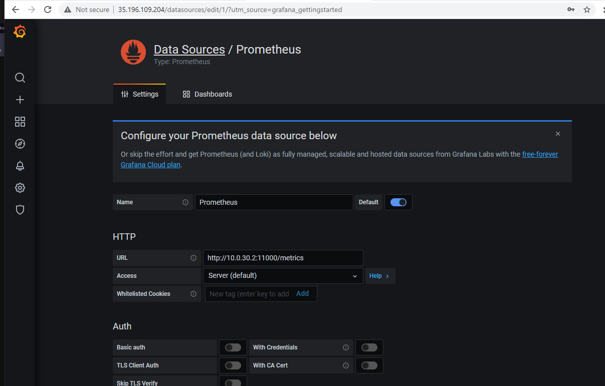

# vscode rest examples

big thanks to @gallarda Doug Gallarda for help on the super fun JQ filters.

## with curl
requires target, jq, curl

### setup targets
```bash
nimPublic=$(terraform output --json | jq -r .nim.value.network_interface[0].access_config[0].nat_ip)
nimPrivate=$(terraform output --json | jq -r  .nim.value.network_interface[0].network_ip)
instance=docker-docker-nim-cat
```
### list inventory
```bash
# all
curl -skX GET "https://$nimPublic/api/v0/instances" -H  "accept: application/json" | jq .list[]
# get id by name
curl -skX GET "https://$nimPublic/api/v0/instances" -H  "accept: application/json" | jq -r ".list[] |select(.hostname | contains(\"$instance\")).instance_id"
```
### get config
```bash
# set an id
id=$(curl -skX GET "https://$nimPublic/api/v0/instances" -H  "accept: application/json" | jq -r ".list[] |select(.hostname | contains(\"$instance\")).instance_id")
# get config by id
curl -skX GET "https://$nimPublic/api/v0/instances/$id/config?current=true" -H  "accept: application/json" | jq .
```
### modify config
```bash
# get current config
allconfig=$(curl -skX GET "https://$nimPublic/api/v0/instances/$id/config?current=true" -H  "accept: application/json")
# view current config /etc/nginx/conf.d/default.conf
echo $allconfig  | jq -r '.files[] |  select( .name=="/etc/nginx/conf.d/default.conf").contents' | base64 -d
# save old config
oldConfig=$(echo $allconfig  | jq -r '.files[] |  select( .name=="/etc/nginx/conf.d/default.conf").contents')
# create new config
conf=$(cat -<<EOF

server {
    # my change adds grafana!
    listen       80 default_server;
    server_name  localhost;

    #charset koi8-r;
    #access_log  /var/log/nginx/host.access.log  main;

    # location / {
    #     root   /usr/share/nginx/html;
    #     index  index.html index.htm;
    # }
    location / {
        proxy_pass http://localhost:3000;
    }

    #error_page  404              /404.html;

    # redirect server error pages to the static page /50x.html
    #
    error_page   500 502 503 504  /50x.html;
    location = /50x.html {
        root   /usr/share/nginx/html;
    }

    # proxy the PHP scripts to Apache listening on 127.0.0.1:80
    #
    #location ~ \.php$ {
    #    proxy_pass   http://127.0.0.1;
    #}

    # pass the PHP scripts to FastCGI server listening on 127.0.0.1:9000
    #
    #location ~ \.php$ {
    #    root           html;
    #    fastcgi_pass   127.0.0.1:9000;
    #    fastcgi_index  index.php;
    #    fastcgi_param  SCRIPT_FILENAME  /scripts$fastcgi_script_name;
    #    include        fastcgi_params;
    #}

    # deny access to .htaccess files, if Apache's document root
    # concurs with nginx's one
    #
    #location ~ /\.ht {
    #    deny  all;
    #}

    # enable /api/ location with appropriate access control in order
    # to make use of NGINX Plus API
    #
    #location /api/ {
    #    api write=on;
    #    allow 127.0.0.1;
    #    deny all;
    #}

    # enable NGINX Plus Dashboard; requires /api/ location to be
    # enabled and appropriate access control for remote access
    #
    #location = /dashboard.html {
    #    root /usr/share/nginx/html;
    #}
}

EOF
)
# convert to b64
confB64=$(echo -e "$conf" | base64 -w 0 )
# doug's map magic to make the new body payload
body=$(echo $allconfig |jq 'del(..|.created?)|del(..|.modified?)| .files |= map(if .name=="/etc/nginx/conf.d/default.conf" then .contents="'$confB64'" else . end)')
## send config !!! NOTE this is declartive and needs all the config not just your file. !!!
curl -skX POST "https://$nimPublic/api/v0/instances/$id/config" -H  "accept: application/json" -H  "Content-Type: application/json" -d "$body"
# expect 200 OK
# {
#  "err": ""
# }
# create body to plublish change
applyBody=$(cat -<<EOF
{
  "instance_id": "$id",
  "force": true
}
EOF
)
# send the change to the managed instance
curl -skX POST "https://$nimPublic/api/v0/instances/$id/config/publish" -H  "accept: application/json" -H  "Content-Type: application/json" -d "$applyBody"
# expect 200 OK
# {
#  "err": ""
# }
# view new config
curl -skX GET "https://$nimPublic/api/v0/instances/$id/config?current=true" -H  "accept: application/json" | jq -r '.files[] |  select( .name=="/etc/nginx/conf.d/default.conf").contents' | base64 -d
## revert config
# get current
allconfig=$(curl -skX GET "https://$nimPublic/api/v0/instances/$id/config?current=true" -H  "accept: application/json")
# create body
body=$(echo $allconfig |jq 'del(..|.created?)|del(..|.modified?)| .files |= map(if .name=="/etc/nginx/conf.d/default.conf" then .contents="'$oldConfig'" else . end)')
# stage change
curl -skX POST "https://$nimPublic/api/v0/instances/$id/config" -H  "accept: application/json" -H  "Content-Type: application/json" -d "$body"
# apply old config
curl -skX POST "https://$nimPublic/api/v0/instances/$id/config/publish" -H  "accept: application/json" -H  "Content-Type: application/json" -d "$applyBody"
# view reverted config
curl -skX GET "https://$nimPublic/api/v0/instances/$id/config?current=true" -H  "accept: application/json" | jq -r '.files[] |  select( .name=="/etc/nginx/conf.d/default.conf").contents' | base64 -d
```
### After you make the change enable a grafana dashboard!
https://NIM/docs/guides/metrics/

]

1. get the docker public IP from terraform
    ```bash
    cd ~/worksapce/terraform/gcp
    . init.sh && info
      nim_web_private_direct: http://10.0.30.2:11000
      ==== docker ====
      ssh_public: 35.196.109.204
    ```
2. login to grafana at http://35.196.109.204

3. configuration -> add a datasource
   - select prometheus type
   - name it "nginx-manager"
      use the nim internal address

      url = http://10.0.30.2:11000/metrics
   - `click` save and test
      ]
4. add a dashboard!
    - get the dashboard json from NIM

        https://35.231.64.108/docs/examples/grafana/nginx-manager.json
    - `click` create/plus and select `import`
    - paste in the json from NIM and select `load`
      ]
    - apply/import the json
      ]

      this should drop you to "general/NGINX landscape"

    - `enjoy all the pretty data`
  ```

## with the generic calls when its added

using the f5vscode plugin

https://f5devcentral.github.io/vscode-f5/#/generic_rest_calls

### list inventory

```json
{
    "url": "https://35.237.98.74/api/v0/instances",
    "method": "GET"
}

{
    "url": "/api/v0/instances",
    "method": "GET"
}
```

### run a scan
```json

{
    "url": "https://35.237.98.74/api/v0/scan",
    "method": "POST",
    "body": {
      "cidr": "10.0.30.0/24",
      "ports": [
        80,443
      ]
  }
}


{
    "url": "/api/v0/scan",
    "method": "POST",
    "body": {
    "cidr": "10.0.30.0/24",
    "ports": [
      80,443
    ]
  }
}

```
### view a scan result
```json
{
    "url": "https://35.237.98.74/api/v0/scan",
    "method": "GET"
}

{
    "url": "/api/v0/instances",
    "method": "GET"
}
```

### view configuration
get a config by instance id

```json
{
    "url": "/api/v0/instances/$id/config?current=true",
    "method": "GET",
}
```
