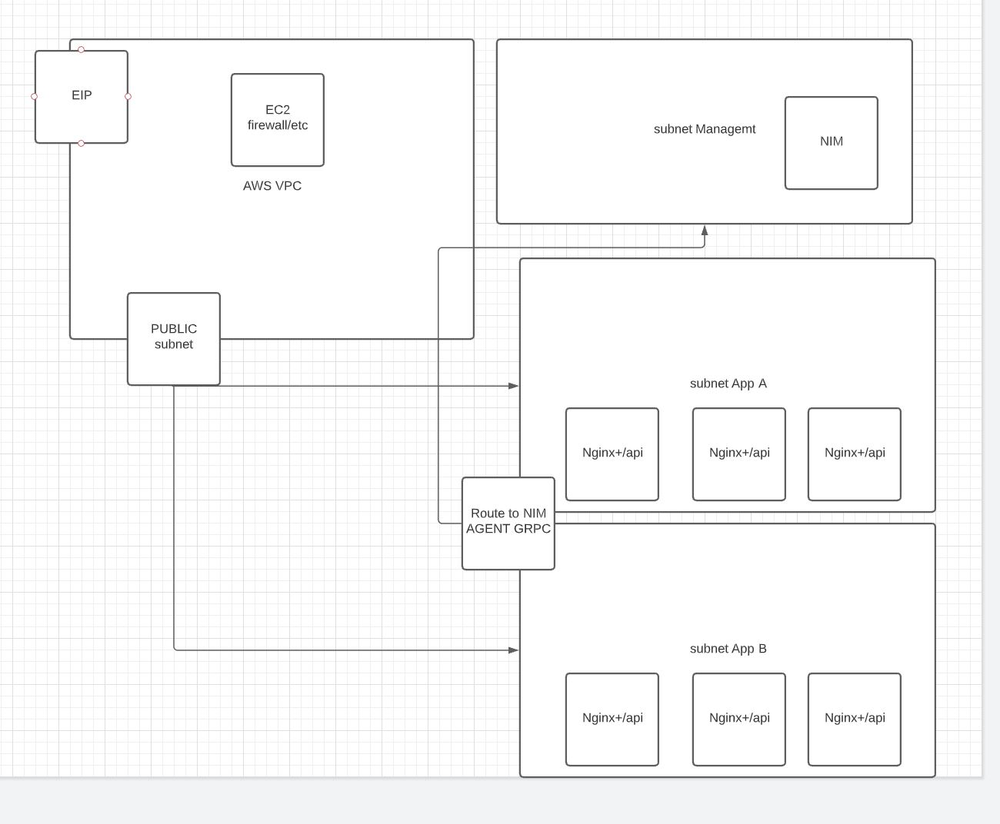

# nim party goes to fargate!


## overview


## authenticate
 - set aws creds
    - export
      ```bash
        export AWS_ACCESS_KEY_ID="mykeyid"
        export AWS_SECRET_ACCESS_KEY="mykeyvalue"
        export AWS_SESSION_TOKEN="mytokenvalue"
        export AWS_DEFAULT_REGION="us-east-1"
      ```
    - cli configure
      ```bash
        aws configure
      ```
 - set aws key pair name in admin.auto.tfvars.example
 - set region in admin.auto.tfvars.example
 - set allowed_mgmt_cidr in admin.auto.tfvars.example
 - move example file so terraform picks it up
    ```bash
      mv admin.auto.tfvars.example admin.auto.tfvars
    ```
## optional create ECR skip if you have one
 ```bash
  cd ecr
  setup
 ```
## build and push image
 - https://docs.aws.amazon.com/AmazonECR/latest/userguide/getting-started-cli.html
 - login
  ```bash
    REGION="myregion"
    AWS_ACCOUNT_ID="myaccountid"
    aws ecr get-login-password --region $REGION | docker login --username AWS --password-stdin ${AWS_ACCOUNT_ID}.dkr.ecr.$REGION.amazonaws.com
  ```
 - build and tag
    - [nim](../../docker/nim-plus/readme.md)
      ```bash
        docker tag nim-plus:latest ${AWS_ACCOUNT_ID}.dkr.ecr.$REGION.amazonaws.com/nim-plus:latest
      ```
    - [nginx+](../../docker/nginx-plus/readme.md)
      ```bash
        docker tag nginx-plus:latest ${AWS_ACCOUNT_ID}.dkr.ecr.$REGION.amazonaws.com/nginx-plus:latest
      ```

## refrence image in terraform vars

## deploy
